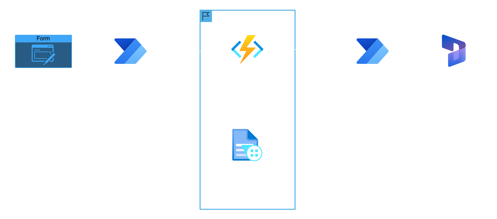

# 📌 AI Document Validator – Azure Functions (C#)

> Serverless backend that validates New Jersey business documents with Azure AI Document Intelligence and generates beautiful PDF summary reports to accelerate incentive eligibility checks for the New Jersey Economic Development Authority (NJEDA) – ready for Power Automate or Dynamics 365 workflows.

---

## 🧠 What It Does

- 🚀 **Automatic Document Analysis & Classification** - Automatically detects and classifies the business document type (Tax Clearance, Certificate of Formation, Bylaws, etc.) using Azure AI Document Intelligence.
- 🔍 **Context-Aware Validation Rules** - Checks signatures, dates, organization names, keywords, and more – each rule set is tuned per document type.
- 📄 **Professional PDF Reports** - Uses PdfSharpCore to create a consolidated report and individual summaries, complete with color-coded status badges.
- ⚡️ **Single HTTP Endpoint** - POST `/api/validate-documents` accepts a JSON payload with one or many base64 files and returns validation results + PDF.
- 🌐 **Made for Power Automate & Dynamics 365** - Secure, key-protected endpoint that plugs directly into your low-code flows.

---

## 🧱 Architecture



Key Design Points:

1. **Isolated .NET 8 worker** – better cold-start and package management.
2. **Dependency Injection** – services are singletons, stateless, and thread-safe.
3. **Parallel Processing** – documents are analyzed concurrently for speed.

---

## 🧰 Tech Stack

| Layer          | Tools & Frameworks                                             |
|----------------|----------------------------------------------------------------|
| **Function**   | Azure Functions Isolated (.NET 8), Newtonsoft.Json             |
| **AI/ML**      | Azure AI Document Intelligence (Form Recognizer)               |
| **PDF**        | PdfSharpCore                                                   |
| **Testing**    | xUnit, `Tests/` console harness                                |
| **Dev Ops**    | GitHub Actions (example), Azure CLI / Functions Core Tools     |

---

## 🧪 Setup

### 1. Prerequisites

- [.NET 8 SDK](https://dotnet.microsoft.com/download/dotnet/8.0)
- [Azure Functions Core Tools](https://learn.microsoft.com/azure/azure-functions/functions-run-local)
- An **Azure Document Intelligence** (Form Recognizer) resource & key

### 1.1 Provision Azure AI Document Intelligence

> Skip this if you already have a Document Intelligence instance.

#### Option A — Azure Console

1. In the portal, click **Create a resource** → search "Document Intelligence" (formerly *Form Recognizer*).
2. Click **Create** and fill in:
   • Subscription & Resource Group  
   • **Region** close to your users  
   • **Name** (e.g. `doc-intel-<initials>`)  
   • **Pricing Tier**: *S0* (paid) or *F0* (free trial, limited quota).
3. Review + Create, then **Go to resource**.
4. Under **Keys and Endpoint**, copy **Endpoint** and **Key 1** – paste these into `DI_ENDPOINT` / `DI_KEY` later.

#### Option B — Azure CLI (Automation)

```bash
FR_NAME=ai-doc-validator-$RANDOM   # globally unique
RG=rg-ai-doc-val            # reuse or create
LOCATION=eastus

# Create the cognitive services account (Form Recognizer kind)
az cognitiveservices account create \
  --name $FR_NAME \
  --resource-group $RG \
  --kind FormRecognizer \
  --sku S0 \
  --location $LOCATION \
  --yes

# Fetch endpoint & key
az cognitiveservices account show \
  --name $FR_NAME \
  --resource-group $RG \
  --query "properties.endpoint" -o tsv

az cognitiveservices account keys list \
  --name $FR_NAME \
  --resource-group $RG \
  --query "key1" -o tsv
```

Paste the returned values into `local.settings.json` (for local dev) **or** into your Function App's **Configuration → Application settings** once deployed.

### 2. Clone & restore

```bash
# Clone
$ git clone https://github.com/kaushik-manivannan/ai-doc-validator-csharp.git
$ cd ai-doc-validator-csharp

# Install C# dependencies
$ dotnet restore
```

### 3. Configure secrets

Create or edit `local.settings.json`:

```json
{
  "IsEncrypted": false,
  "Values": {
    "AzureWebJobsStorage": "UseDevelopmentStorage=true",
    "FUNCTIONS_WORKER_RUNTIME": "dotnet-isolated",
    "DI_ENDPOINT": "https://<your-form-recognizer>.cognitiveservices.azure.com/",
    "DI_KEY": "<form-recognizer-key>"
  }
}
```

> **Tip:** `local.settings.json` is ignored by Git, so your secrets stay local.

### 4. Run locally

```bash
# start the Azure Function runtime
$ func start
```

Test with Postman:

1. Create a new POST request to `http://localhost:7071/api/validate-documents`

2. Set Headers:
   - Key: `Content-Type`
   - Value: `application/json`

3. In the Body tab:
   - Select "raw"
   - Choose "JSON" format
   - Paste the test payload (from `Tests/testPayload.json`):

   ```json
   {
     "organizationname": "Example Corp LLC", 
     "FEIN": "123456789",
     "files": [
       {
         "FileName": "TaxClearance.pdf",
         "FileContentBase64": "<your-base64-encoded-pdf>"
       }
     ]
   }
   ```

The API will return a base64-encoded PDF report in the response. When using the test harness directly, PDF reports are written to the `Tests/output` directory.

---

## 🚀 Deploy to Azure

### Option A — VS Code Extension (Recommended for first-timers)

1. Install the **Azure Functions** extension in VS Code (plus **Azure Account** if you haven't already).
2. Sign in to Azure: press `F1` (or `⌘⇧P`) and run `Azure: Sign In`.
3. Open this folder in VS Code, then build once:

   ```bash
   dotnet build -c Release
   ```

4. In the **AZURE FUNCTIONS** side bar, click **Deploy to Function App…**.
5. When prompted:
   • Select **Create new Function App**  
   • Enter a globally-unique name (e.g. `ai-doc-validator-<your-initials>`)  
   • Choose **.NET 8 Isolated** runtime & **Consumption** plan  
   • Pick your desired region.
6. Wait for the deployment to finish (status bar). VS Code will ask to upload your `local.settings.json` as **Application Settings**—choose **Yes**.
7. In the Azure portal, add the secrets it couldn't copy automatically:
   • `DI_ENDPOINT`  
   • `DI_KEY`
8. Copy the function URL (right-click **ValidateDocuments** > **Copy Function URL**) and test it with Postman or curl.

### Option B — Azure CLI / Core Tools

```bash
# ------ vars ------
APP_NAME=ai-doc-val-$RANDOM   # must be globally unique
RG=rg-ai-doc-val
LOCATION=eastus
# ------------------

# 1) Resource group
az group create --name $RG --location $LOCATION

# 2) Function App on Consumption (.NET 8 isolated)
az functionapp create \
  --name $APP_NAME \
  --resource-group $RG \
  --consumption-plan-location $LOCATION \
  --functions-version 4 \
  --runtime dotnet-isolated

# 3) Deploy your code
func azure functionapp publish $APP_NAME --csharp

# 4) Configure secrets
az functionapp config appsettings set \
  --name $APP_NAME \
  --resource-group $RG \
  --settings DI_ENDPOINT="https://<your-form-recognizer>.cognitiveservices.azure.com/" DI_KEY="<key>"

# 5) Grab the default key (needed for the query-string ?code=…)
az functionapp function keys list \
  --resource-group $RG \
  --name $APP_NAME \
  --function-name ValidateDocuments \
  --query "default"
```

> The command above prints the function key. Combine it with the host name:  
> `https://$APP_NAME.azurewebsites.net/api/validate-documents?code=<key>`

---

## 🤖 Power Automate Integration

1. Add an **HTTP** action – method `POST`, URL `https://<func-app>.azurewebsites.net/api/validate-documents?code=<function-key>`.

2. Build the body using JSON:

```json
{
  "organizationname": "Example Corp LLC",
  "FEIN": "123456789",
  "files": [
    {
      "FileName": "TaxClearance.pdf",
      "FileContentBase64": "<base64>"
    }
  ]
}
```

3. Parse the response to save PDFs, update Dynamics 365 records, or notify users.

---

## 🧠 Core Modules

| File / Directory                     | Responsibility                                                    |
|--------------------------------------|-------------------------------------------------------------------|
| `Functions/ValidateDocumentsFunction.cs` | HTTP trigger, request validation, orchestration               |
| `Services/DocumentValidatorService.cs`   | Document type detection & rule-based validation               |
| `Services/PdfGeneratorService.cs`        | Creates consolidated & per-document PDF reports               |
| `Services/ConfigurationService.cs`       | Loads environment variables & secrets (local + Azure)         |
| `Models/ValidationRequest.cs`            | Strongly-typed input contract                                 |
| `Models/ValidationResponse.cs`           | Strongly-typed output contract                                |
| `Tests/`                                 | Console harness + sample payloads for quick local testing     |

---

## 🛡️ Security & Privacy

- No documents are persisted – everything is processed **in-memory**.
- HTTPS enforced on Azure; local dev uses `host.json` defaults.
- Secrets live in Azure **App Settings** or `local.settings.json` – never hard-coded.

---

## 📦 Roadmap

- [ ] Modularize validation rules for easier extension

---

## 🤝 Contributing

Contributions are welcome! Please open an issue to discuss your idea or bug, then submit a PR.

1. Fork the repo & create your branch (`git checkout -b feature/my-feature`).
2. Commit your changes (`git commit -am 'feat: add my feature'`).
3. Push to the branch (`git push origin feature/my-feature`).
4. Open a Pull Request.

---

## 📄 License

MIT © 2024 – see [`LICENSE`](./LICENSE) for details.

---

## 👥 Authors & Acknowledgements

Built by **Kaushik Manivannan & Aarushi Thejaswi** for the **New Jersey Economic Development Authority**.
